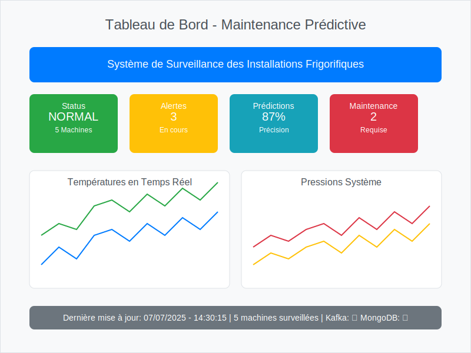
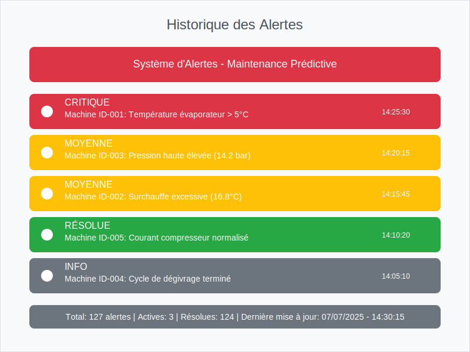
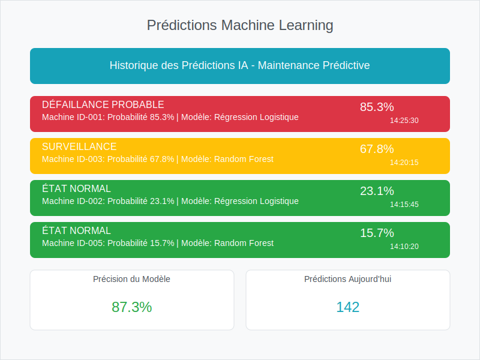

# 🧊 Système de Maintenance Prédictive pour Installations Frigorifiques

> **Un système intelligent de surveillance et de prédiction des défaillances pour les installations frigorifiques et thermodynamiques**

Ce projet implémente un système de maintenance prédictive en temps réel pour les installations frigorifiques utilisant Apache Kafka pour le streaming de données, Machine Learning pour la prédiction des défaillances, et une interface web Flask pour la visualisation et l'analyse thermodynamique.

## 🌟 Fonctionnalités clés

✅ **Surveillance en temps réel** - Monitoring continu des paramètres thermodynamiques
✅ **Prédiction IA** - Modèles ML pour anticiper les défaillances
✅ **Interface moderne** - Dashboard interactif avec mises à jour en temps réel
✅ **Alertes intelligentes** - Notifications automatiques basées sur les seuils critiques
✅ **Containerisation** - Déploiement facile avec Docker Compose
✅ **Architecture scalable** - Kafka pour le streaming haute performance
✅ **Analyse thermodynamique** - Calculs automatiques des indicateurs de performance

## 🎯 Vue d'ensemble du projet

Le système surveille en temps réel les paramètres critiques des installations frigorifiques (températures, pressions, surchauffe, sous-refroidissement, consommation électrique, vibrations) et utilise des algorithmes d'apprentissage automatique pour prédire les défaillances avant qu'elles ne se produisent.

**Avantages** :

- 🔍 **Détection précoce** des anomalies
- 💰 **Réduction des coûts** de maintenance
- ⚡ **Optimisation énergétique** des installations
- 📊 **Analyse des tendances** et historiques
- 🔧 **Maintenance proactive** au lieu de corrective

## 📸 Aperçu du tableau de bord

### Dashboard Principal


*Vue d'ensemble du tableau de bord avec monitoring temps réel*

### Alertes et Notifications


*Page des alertes avec historique des événements*

### Prédictions ML


*Historique des prédictions avec scores de confiance*

> 📝 **Note** : Les images ci-dessus sont des exemples visuels. Pour voir le vrai tableau de bord, démarrez l'application avec `.\run_all_services.bat` et allez sur http://localhost:5001
>
> 🔄 **Mise à jour** : Pour remplacer ces exemples par de vraies captures d'écran, suivez les instructions dans le dossier `screenshots/`

### Fonctionnalités principales

- **Streaming de données en temps réel** : Utilisation d'Apache Kafka pour ingérer et traiter les données de capteurs
- **Prédictions Machine Learning** : Modèle de régression logistique pour prédire les défaillances d'installations frigorifiques
- **Analyse thermodynamique** : Calcul automatique des indicateurs de performance (COP, ratio de pression, etc.)
- **Tableau de bord interactif** : Visualisation en temps réel des statuts des machines et des lectures de capteurs
- **Système d'alertes** : Notifications automatiques pour les défaillances potentielles et conditions anormales
- **Intégration WebSocket** : Mises à jour en direct du tableau de bord sans actualisation de page
- **Containerisation Docker** : Déploiement facile avec Docker Compose

## 🛠️ Technologies utilisées

### Backend & Services

- **Flask** + **Flask-SocketIO** - Framework web Python avec WebSocket
- **Apache Kafka** - Streaming de données en temps réel
- **MongoDB** - Base de données NoSQL pour stockage
- **Docker** + **Docker Compose** - Containerisation et orchestration

### Machine Learning & Données

- **scikit-learn** - Algorithmes ML (Régression logistique, Random Forest)
- **pandas** + **NumPy** - Manipulation et analyse des données
- **PySpark** - Traitement distribué des données (optionnel)

### Frontend & Interface

- **Bootstrap 5** - Framework CSS moderne et responsive
- **Chart.js** - Graphiques interactifs et animations
- **Socket.IO** - Communication bidirectionnelle en temps réel
- **HTML5** + **CSS3** + **JavaScript ES6+**

### Outils de développement

- **Python 3.8+** - Langage principal
- **Git** - Contrôle de version
- **VS Code** - IDE recommandé

## 🏗️ Architecture du système

```
┌─────────────────┐    ┌─────────────────┐    ┌─────────────────┐
│   Capteurs IoT  │───▶│  Kafka Producer │───▶│  Kafka Broker   │
│  (Simulation)   │    │  (Génération)   │    │  (Streaming)    │
└─────────────────┘    └─────────────────┘    └─────────────────┘
                                                        │
                                                        ▼
┌─────────────────┐    ┌─────────────────┐    ┌─────────────────┐
│   Dashboard     │◀───│  Flask WebApp   │◀───│ Streaming ML    │
│  (Interface)    │    │  (API + UI)     │    │  (Prédictions)  │
└─────────────────┘    └─────────────────┘    └─────────────────┘
                                │                        │
                                ▼                        ▼
                       ┌─────────────────┐    ┌─────────────────┐
                       │    MongoDB      │    │   Modèles ML    │
                       │  (Stockage)     │    │ (Entraînement)  │
                       └─────────────────┘    └─────────────────┘
```

## 📁 Structure du projet

```
📦 Syst-me-Pr-dictif-de-Maintenance-Industrielle/
├── 🐍 **Scripts Python**
│   ├── app.py                          # 🌐 Application Flask principale
│   ├── kafka_consumer.py               # 📥 Consommateur Kafka
│   ├── kafka_producer.py               # 📤 Producteur Kafka (simulation)
│   ├── streamingpredict.py             # 🔮 Service de prédiction temps réel
│   ├── train_refrigeration.py          # 🧠 Entraînement Random Forest
│   ├── train_logistic.py               # 🧠 Entraînement Régression Logistique
│   ├── check_mongo.py                  # 🔍 Test connectivité MongoDB
│   └── test_system.py                  # 🧪 Test système complet
├── 🤖 **Modèles ML**
│   ├── model_logistic_refrigeration.pkl # 📊 Modèle de prédiction
│   └── model.pkl                       # 📊 Modèle alternatif
├── 🌐 **Interface Web**
│   └── templates/
│       ├── dashboard.html              # 🏠 Tableau de bord principal
│       ├── alerts.html                 # 🚨 Historique des alertes
│       └── predictions.html            # 📈 Historique des prédictions
├── 🐳 **Configuration Docker**
│   ├── docker-compose.yml              # 🐋 Orchestration des services
│   └── mongo-init.js                   # 🗄️ Initialisation MongoDB
├── 🔧 **Scripts d'automatisation**
│   ├── run_all_services.bat            # ▶️ Démarrage automatique
│   └── stop_all_services.bat           # ⏹️ Arrêt des services
├── 📋 **Configuration**
│   ├── requirements.txt                # 📦 Dépendances Python
│   └── README.md                       # 📖 Documentation
├── 📸 **Documentation**
│   └── screenshots/                    # 🖼️ Captures d'écran du dashboard
│       ├── dashboard-main.svg          # 🏠 Tableau de bord principal (exemple)
│       ├── alerts-page.svg             # 🚨 Page des alertes (exemple)
│       ├── predictions-page.svg        # 📈 Page des prédictions (exemple)
│       └── README.md                   # 📝 Instructions pour les captures
└── 🗂️ **Ressources**
    └── static/                         # 🎨 CSS, JS, Images
```

## 🚀 Démarrage rapide

### ⚡ Option 1 : Démarrage automatique (Recommandé)

1. **Ouvrir PowerShell en tant qu'administrateur** dans le dossier du projet
2. **Vérifier les prérequis** :
   ```powershell
   .\check_prerequisites.ps1
   ```
3. **Démarrer tous les services** :
   ```powershell
   .\run_all_services.ps1
   ```
4. **Vérifier le statut des services** :
   ```powershell
   .\check_services_status.ps1
   ```
5. **Ouvrir votre navigateur** et aller sur : `http://localhost:5002`

### 🔧 Option 2 : Démarrage manuel (étape par étape)

Si vous préférez contrôler chaque étape :

1. **Démarrer les services Docker** :

   ```powershell
   docker-compose up -d
   ```
2. **Attendre que les services se lancent** (15 secondes) :

   ```powershell
   Start-Sleep -Seconds 15
   ```
3. **Démarrer l'application Flask** :

   ```powershell
   python app.py
   ```
4. **Démarrer le producteur Kafka** (nouveau terminal) :

   ```powershell
   python kafka_producer.py
   ```
5. **Démarrer le service de prédiction** (nouveau terminal) :

   ```powershell
   python streamingpredict.py
   ```

## 📋 Installation et configuration

### Prérequis

- **Python 3.11+** : [Télécharger Python](https://www.python.org/downloads/)
- **Docker Desktop** : [Télécharger Docker Desktop](https://www.docker.com/products/docker-desktop/)
- **Git** : [Télécharger Git](https://git-scm.com/downloads)
- **8 Go de RAM** recommandés pour une performance optimale

### ✅ Vérification automatique des prérequis

Utilisez le script de vérification automatique :

```powershell
.\check_prerequisites.ps1
```

Ce script vérifie :

- ✅ Installation de Python
- ✅ Installation de Docker
- ✅ Docker en cours d'exécution
- ✅ Packages Python requis
- ✅ Installation automatique des packages manquants

### Étapes d'installation détaillées

#### 1. Cloner le dépôt

```powershell
git clone <repository_url>
cd Syst-me-Pr-dictif-de-Maintenance-Industrielle
```

#### 2. Installer les dépendances Python

```powershell
# Installer les dépendances
pip install -r requirements.txt
```

#### 3. Vérifier l'installation de Docker

```powershell
# Vérifier que Docker est installé et en cours d'exécution
docker --version
docker-compose --version

# Démarrer Docker Desktop si ce n'est pas déjà fait
```

#### 4. Nettoyer les anciens containers (si nécessaire)

```powershell
# Nettoyer les anciens containers
docker rm -f zookeeper kafka mongodb mongo-express kafka-ui
docker-compose down
```

#### 5. Démarrer l'infrastructure Docker

```powershell
# Démarrer tous les services Docker en arrière-plan
docker-compose up -d

# Vérifier que les services sont démarrés
docker-compose ps
```

Les services suivants seront démarrés :

- **Zookeeper** (port 2181) : Service de coordination pour Kafka
- **Kafka** (port 9092) : Plateforme de streaming distribué
- **MongoDB** (port 27017) : Base de données NoSQL
- **Kafka UI** (port 8080) : Interface web pour Kafka
- **Mongo Express** (port 8081) : Interface web pour MongoDB

#### 6. Vérifier que les services sont opérationnels

```powershell
# Tester la connectivité du système
python test_system.py
```

Vous pouvez aussi vérifier manuellement :

- **Kafka UI** : http://localhost:8080
- **MongoDB Express** : http://localhost:8081 (utilisateur : admin, mot de passe : admin)
- **MongoDB** : Connexion sur `mongodb://localhost:27017`

#### 7. Le modèle de Machine Learning sera créé automatiquement

Le modèle est créé automatiquement au premier démarrage si il n'existe pas.

## 🎯 Utilisation de l'application

### Démarrage du système complet

Une fois l'installation terminée, utilisez les nouvelles méthodes simplifiées :

#### 🚀 Méthode recommandée : Scripts PowerShell automatiques

1. **Démarrer tous les services** :

   ```powershell
   .\run_all_services.ps1
   ```
2. **Vérifier le statut** :

   ```powershell
   .\check_services_status.ps1
   ```
3. **Arrêter tous les services** :

   ```powershell
   .\stop_all_services.bat
   ```

#### 🔧 Méthode alternative : Démarrage manuel

Si vous voulez contrôler chaque service individuellement :

1. **Démarrer les services Docker** :

   ```powershell
   docker-compose up -d
   ```
2. **Attendre que les services se lancent** (15 secondes) :

   ```powershell
   Start-Sleep -Seconds 15
   ```
3. **Démarrer l'application web Flask** :

   ```powershell
   python app.py
   ```
4. **Démarrer le producteur Kafka** dans un nouveau terminal :

   ```powershell
   python kafka_producer.py
   ```
5. **Démarrer le service de prédiction** dans un nouveau terminal :

   ```powershell
   python streamingpredict.py
   ```
6. **Optionnel - Surveiller les messages Kafka** dans un nouveau terminal :

   ```powershell
   python kafka_consumer.py
   ```

### Accès au tableau de bord

Une fois tous les services démarrés, ouvrez votre navigateur web et allez sur :

```
http://localhost:5002
```

> **🔄 Mise à jour importante** : Le port a été changé de 5001 à 5002 pour éviter les conflits.

### Interfaces disponibles

- **🌐 Tableau de bord principal** : http://localhost:5002
- **📊 Kafka UI** : http://localhost:8080 (surveillance des messages)
- **📈 MongoDB Express** : http://localhost:8081 (consultation de la base de données)
  - Utilisateur : `admin`
  - Mot de passe : `admin`

### Vérification du système

Pour vérifier que tout fonctionne correctement :

```powershell
# Vérifier tous les services
.\check_services_status.ps1

# Ou vérifier manuellement
docker ps                    # Voir les containers Docker
Get-Process -Name python     # Voir les processus Python
```

### Arrêt du système

Pour arrêter proprement tous les services :

```powershell
# Méthode rapide
.\stop_all_services.bat

# Ou méthode manuelle
# 1. Arrêter les services Python (Ctrl+C dans chaque terminal)
# 2. Arrêter les services Docker
docker-compose down
```

### Utilisation du tableau de bord

1. **Tableau de bord principal** affiche :

   - Graphique de vue d'ensemble du statut des machines
   - Lectures de capteurs en temps réel (températures, pressions, surchauffe, sous-refroidissement)
   - Alertes récentes avec indicateurs de gravité
   - Prédictions récentes avec scores de probabilité
2. **Navigation vers la page "Historique des prédictions"** pour voir toutes les prédictions passées.
3. **Navigation vers la page "Alertes"** pour voir toutes les alertes et leurs détails.

## Paramètres surveillés

### Capteurs thermodynamiques

- **Température évaporateur** : Température de vaporisation du fluide frigorigène
- **Température condenseur** : Température de condensation du fluide frigorigène
- **Pression haute** : Pression côté refoulement du compresseur
- **Pression basse** : Pression côté aspiration du compresseur
- **Surchauffe** : Différence entre température gaz aspiré et température d'évaporation
- **Sous-refroidissement** : Différence entre température de condensation et température liquide
- **Courant compresseur** : Consommation électrique du compresseur
- **Vibrations** : Niveau de vibrations mécaniques

### Indicateurs calculés

- **COP théorique** : Coefficient de performance théorique
- **Ratio de pression** : Rapport entre pression haute et basse
- **Efficacité compresseur** : Efficacité énergétique du compresseur
- **Différence de température** : Écart entre températures condenseur et évaporateur

## Système d'alertes

Le système génère automatiquement des alertes basées sur :

1. **Prédictions de défaillance** : Alertes haute/moyenne priorité selon la probabilité
2. **Températures critiques** : Évaporateur > -5°C, Condenseur > 50°C
3. **Pressions anormales** : Haute > 16 bar, Basse < 1.5 bar
4. **Surchauffe inadéquate** : < 3°C (risque retour liquide) ou > 15°C (perte efficacité)
5. **Courant compresseur élevé** : > 12A (surcharge)
6. **Vibrations excessives** : > 0.05g (problème mécanique)
7. **Ratio de pression élevé** : > 8 (efficacité réduite)

## Entraînement du modèle

Pour réentraîner le modèle d'apprentissage automatique avec de nouvelles données :

```powershell
# Modèle de régression logistique
python train_logistic.py

# Modèle Random Forest
python train_refrigeration.py
```

Ces scripts génèrent de nouveaux fichiers de modèles qui seront utilisés par l'application.

## Configuration Docker

### Services inclus

- **Zookeeper** : Service de coordination pour Kafka
- **Kafka** : Plateforme de streaming distribué
- **Kafka UI** : Interface web pour Kafka (port 8080)
- **MongoDB** : Base de données NoSQL pour le stockage des données
- **Mongo Express** : Interface web pour MongoDB (port 8081)

### Commandes Docker utiles

```powershell
# Démarrer tous les services
docker-compose up -d

# Arrêter tous les services
docker-compose down

# Voir les logs
docker-compose logs -f

# Redémarrer un service spécifique
docker-compose restart kafka

# Supprimer tous les volumes (réinitialisation complète)
docker-compose down -v
```

## 🔧 Dépannage

### Problèmes courants et solutions

#### 1. **Services Docker non démarrés**

**Symptôme** : Erreur de connexion aux services
**Solutions** :

```powershell
# Vérifier le statut des services
.\check_services_status.ps1

# Démarrer Docker Desktop
# Puis exécuter
docker-compose up -d
```

#### 2. **Containers avec noms conflictuels**

**Symptôme** : `The container name "/zookeeper" is already in use`
**Solutions** :

```powershell
# Nettoyer les anciens containers
docker rm -f zookeeper kafka mongodb mongo-express kafka-ui
docker-compose down

# Puis redémarrer
docker-compose up -d
```

#### 3. **Port 5002 déjà utilisé**

**Symptôme** : `OSError: [WinError 10048] Only one usage of each socket address`
**Solutions** :

```powershell
# Vérifier quels processus utilisent le port
netstat -ano | findstr :5002

# Arrêter les processus Python existants
Get-Process -Name python | Stop-Process -Force

# Redémarrer l'application
python app.py
```

#### 4. **Échec de connexion Kafka**

**Symptôme** : `kafka.errors.NoBrokersAvailable`
**Solutions** :

```powershell
# Vérifier que les services Docker sont démarrés
docker-compose ps

# Vérifier les logs Kafka
docker-compose logs kafka

# Attendre plus longtemps le démarrage
Start-Sleep -Seconds 30
```

#### 5. **Problèmes de connexion MongoDB**

**Symptôme** : `ServerSelectionTimeoutError`
**Solutions** :

```powershell
# Vérifier que MongoDB est en cours d'exécution
docker-compose ps | findstr mongo

# Tester la connexion MongoDB
python check_mongo.py

# Redémarrer MongoDB
docker-compose restart mongodb
```

#### 6. **Commande `timeout` non reconnue**

**Symptôme** : `'timeout' is not recognized as an internal or external command`
**Solution** : Utiliser les nouveaux scripts PowerShell au lieu des scripts .bat

```powershell
# Utiliser les scripts PowerShell
.\run_all_services.ps1
```

#### 7. **Scripts PowerShell bloqués**

**Symptôme** : `Execution of scripts is disabled on this system`
**Solutions** :

```powershell
# Changer la politique d'exécution (temporairement)
Set-ExecutionPolicy -ExecutionPolicy RemoteSigned -Scope CurrentUser

# Ou exécuter le script directement
powershell -ExecutionPolicy Bypass -File .\run_all_services.ps1
```

#### 8. **Le tableau de bord ne se met pas à jour**

**Symptôme** : Les données ne s'affichent pas en temps réel
**Solutions** :

```powershell
# Vérifier que tous les services sont démarrés
.\check_services_status.ps1

# Vérifier les logs des services Python
# Vérifier les connexions WebSocket dans la console du navigateur (F12)
```

### Diagnostic automatique

Utilisez le script de vérification automatique :

```powershell
.\check_prerequisites.ps1    # Vérifier les prérequis
.\check_services_status.ps1  # Vérifier le statut des services
```

Ces scripts vérifient automatiquement :

- ✅ Installation de Python et Docker
- ✅ État des services Docker
- ✅ Connectivité des services web
- ✅ Processus Python en cours d'exécution

### Commandes utiles pour le diagnostic

```powershell
# Vérifier les containers Docker
docker ps

# Vérifier les logs des services
docker-compose logs -f

# Vérifier les ports utilisés
netstat -ano | findstr "5002 8080 8081 27017 9092"

# Vérifier les processus Python
Get-Process -Name python

# Tester la connectivité des services
curl http://localhost:5002/api/system_status
curl http://localhost:8080
curl http://localhost:8081
```

### Réinitialisation complète

Si vous rencontrez des problèmes persistants :

```powershell
# 1. Arrêter tous les services
.\stop_all_services.bat

# 2. Nettoyer Docker
docker-compose down -v
docker system prune -a

# 3. Supprimer les modèles ML (optionnel)
Remove-Item *.pkl

# 4. Redémarrer Docker Desktop

# 5. Redémarrer tout
.\run_all_services.ps1
```

## 🚀 Développement et contribution

### Structure des données

Les données de capteurs suivent ce format JSON :

```json
{
  "timestamp": "2024-01-15T10:30:00",
  "machine_id": 1,
  "operating_mode": "normal",
  "temp_evaporator": -10.5,
  "temp_condenser": 40.5,
  "pressure_high": 12.5,
  "pressure_low": 2.1,
  "superheat": 8.5,
  "subcooling": 5.2,
  "compressor_current": 8.2,
  "vibration": 0.020,
  "efficiency": 0.85
}
```

### Ajout de nouvelles fonctionnalités

1. **Nouveaux capteurs** : Modifier `kafka_producer.py` et `app.py`
2. **Nouvelles alertes** : Ajouter des conditions dans `receive_refrigeration_prediction()`
3. **Nouvelles visualisations** : Modifier les templates HTML et ajouter des graphiques Chart.js
4. **Nouveaux modèles ML** : Créer de nouveaux scripts d'entraînement basés sur `train_logistic.py`

### Améliorations futures

- 🔌 **Intégration IoT** : Connexion avec de vrais capteurs via MQTT
- 📊 **Modèles avancés** : Deep Learning avec TensorFlow/PyTorch
- 🌍 **Multi-sites** : Surveillance de plusieurs installations
- 📱 **Application mobile** : Interface native Android/iOS
- 🔐 **Authentification** : Système de connexion utilisateur
- 📈 **Analytics avancés** : Tableaux de bord personnalisés
- 🌐 **API REST** : Interface pour intégrations tierces
- 📧 **Notifications** : Alertes par email/SMS

### Guide de contribution

1. **Fork** le projet
2. **Créer une branche** pour votre fonctionnalité (`git checkout -b feature/nouvelle-fonctionnalite`)
3. **Commiter** vos changements (`git commit -am 'Ajout nouvelle fonctionnalité'`)
4. **Pusher** vers la branche (`git push origin feature/nouvelle-fonctionnalite`)
5. **Créer une Pull Request**

### 📸 Mise à jour des captures d'écran

Pour ajouter ou mettre à jour les captures d'écran du tableau de bord :

```powershell
# 1. Démarrer l'application
.\run_all_services.bat

# 2. Attendre que les services soient prêts (2-3 minutes)
# 3. Ouvrir http://localhost:5001 dans votre navigateur
# 4. Prendre des captures d'écran de :
#    - Dashboard principal (page d'accueil)
#    - Page des alertes (/alerts)
#    - Page des prédictions (/predictions)
# 5. Sauvegarder les images dans le dossier screenshots/
# 6. Mettre à jour les liens dans le README si nécessaire
```

**Noms de fichiers recommandés** :

- `dashboard-main.png` - Tableau de bord principal
- `alerts-page.png` - Page des alertes
- `predictions-page.png` - Page des prédictions
- `kafka-ui.png` - Interface Kafka (optionnel)
- `mongo-express.png` - Interface MongoDB (optionnel)

### Standards de code

- **PEP 8** pour le style Python
- **Commentaires** en français pour la documentation
- **Tests unitaires** pour les nouvelles fonctionnalités
- **Documentation** mise à jour pour les changements API

---

## 📞 Support et contact

- **Documentation** : Ce README et les commentaires dans le code
- **Issues** : Utilisez les GitHub Issues pour rapporter des bugs
- **Discussions** : GitHub Discussions pour les questions générales
- **Email** : [contact@maintenance-predictive.com](mailto:contact@maintenance-predictive.com)

---

## 🔄 Mise à jour importante - Nouvelles instructions

### ⚠️ Changements récents

- **Port mis à jour** : L'application utilise maintenant le port **5002** au lieu de 5001
- **Nouveaux scripts** : Scripts PowerShell améliorés pour une meilleure compatibilité Windows
- **Vérification automatique** : Script de vérification des prérequis
- **Gestion d'erreurs** : Nettoyage automatique des containers conflictuels

### 🚀 Nouvelle méthode de démarrage recommandée

```powershell
# 1. Vérifier les prérequis
.\check_prerequisites.ps1

# 2. Démarrer tous les services
.\run_all_services.ps1

# 3. Vérifier le statut
.\check_services_status.ps1

# 4. Accéder au dashboard
# http://localhost:5002
```

### 🔧 Résolution des problèmes corrigés

- ✅ **Erreur `timeout` non reconnue** → Utilisation de `Start-Sleep` en PowerShell
- ✅ **Containers conflictuels** → Nettoyage automatique avant démarrage
- ✅ **Port incorrect** → Correction du port 5002 dans tous les scripts
- ✅ **Services Docker non démarrés** → Ajout de `docker-compose up -d`
- ✅ **Caractères spéciaux** → Scripts PowerShell sans accents

---

**Créé par l'équipe de Maintenance Prédictive** - 2024**Licence** : MIT**Version** : 1.0.0

> 💡 **Astuce** : Utilisez les nouveaux scripts PowerShell pour une expérience de démarrage sans problème. Consultez les logs des services Docker avec `docker-compose logs -f` pour diagnostiquer les problèmes de connexion.
